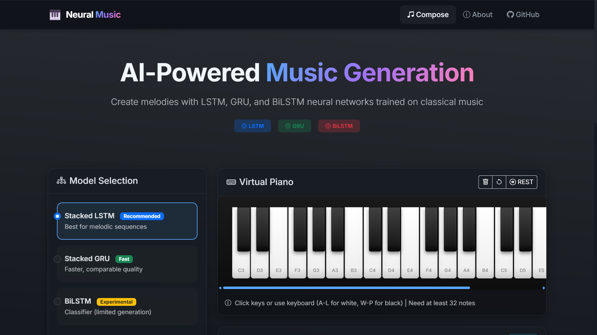
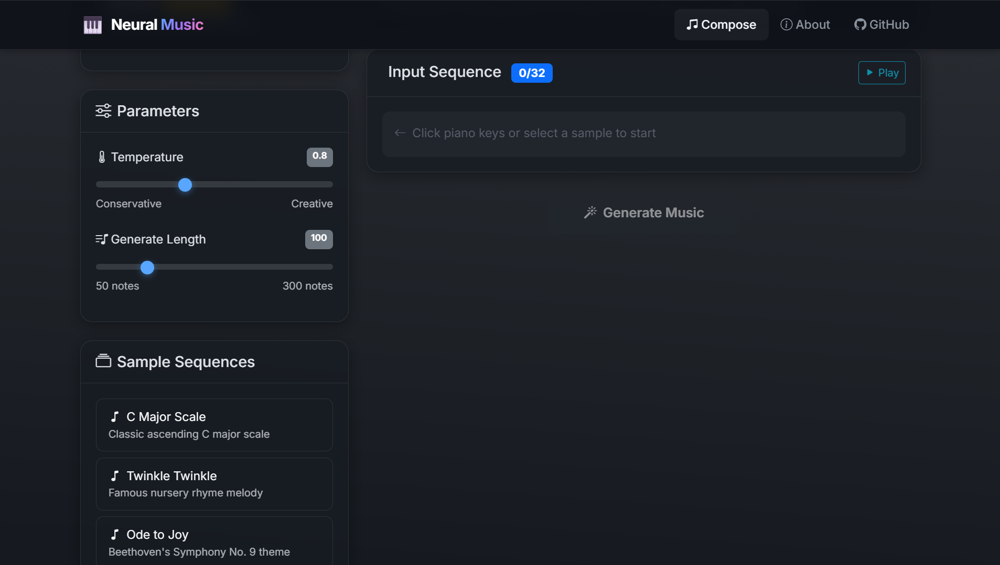
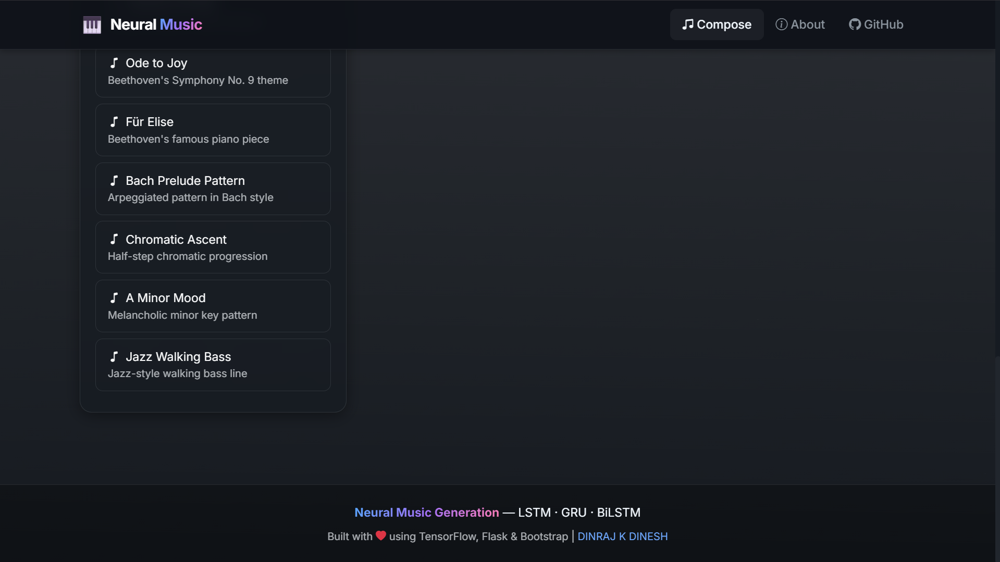
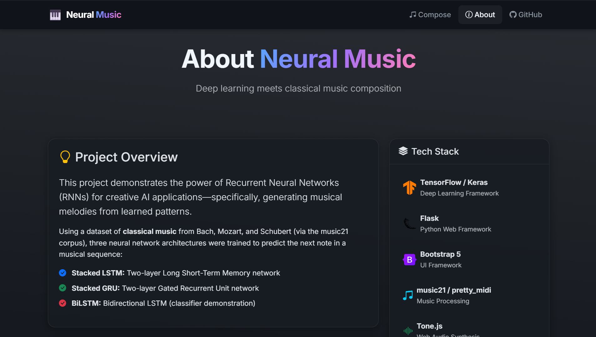
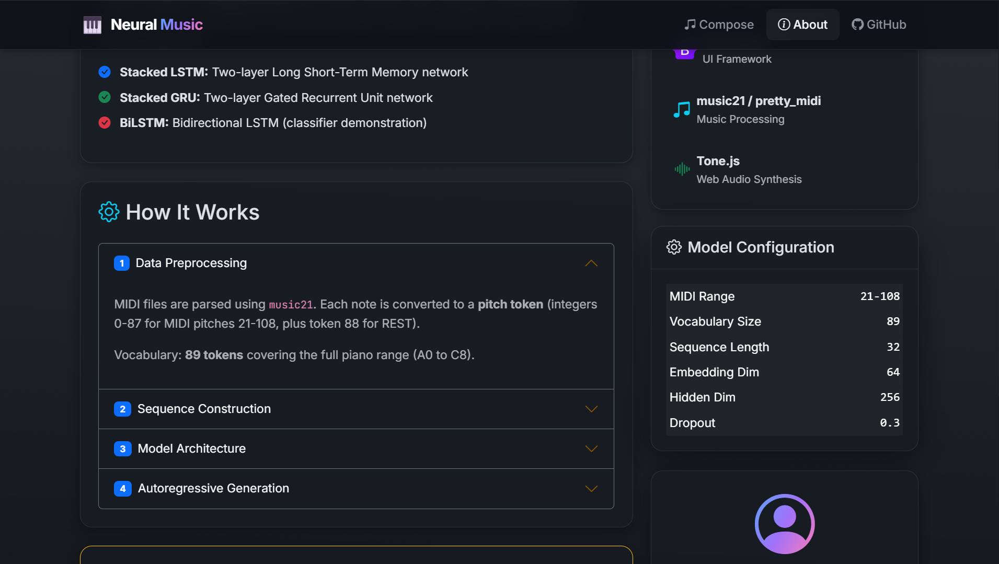
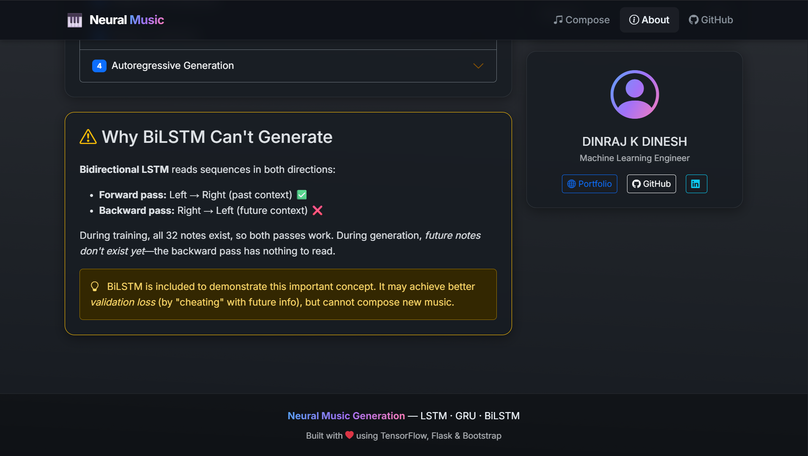
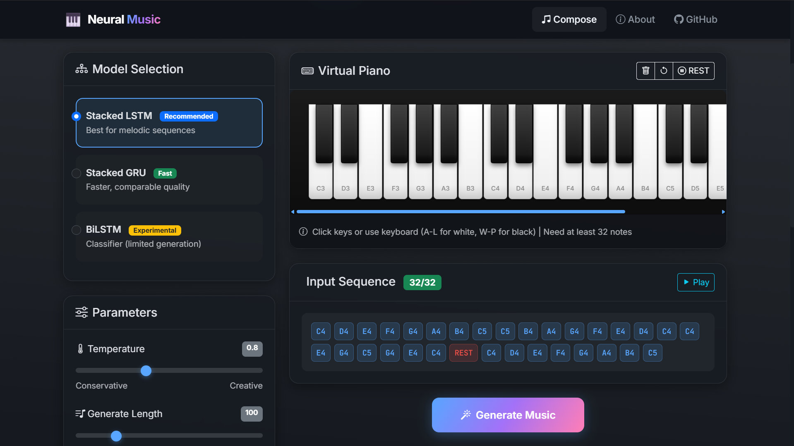
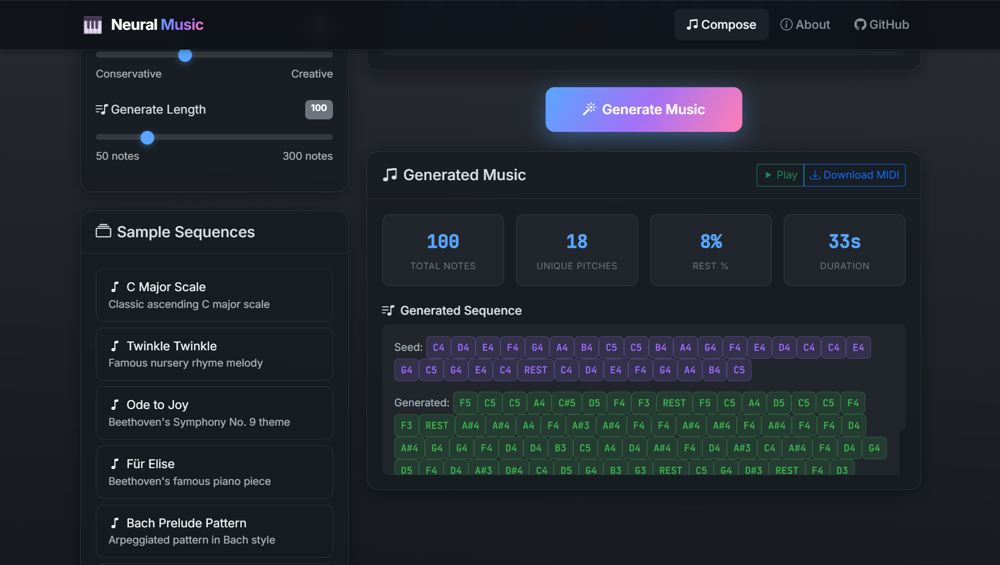
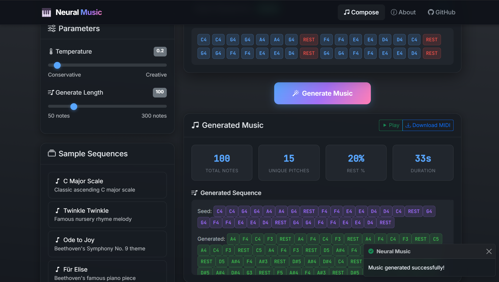
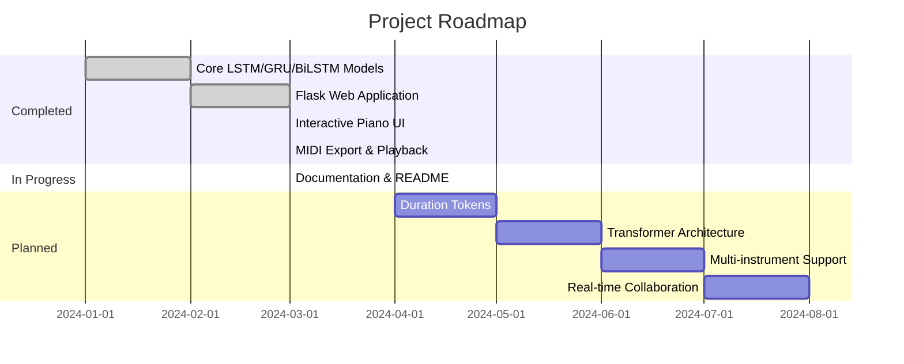

<!-- Animated Header -->


<!-- Badges Row 1 -->
<div align="center">
  
[](https://python.org)
[](https://tensorflow.org)
[](https://keras.io)
[](https://flask.palletsprojects.com)
[](https://getbootstrap.com)

</div>

<!-- Badges Row 2 -->
<div align="center">
  
[](/)
[](LICENSE)
[](/)
[](/)

</div>

<!-- Typing SVG Animation -->
<div align="center">
  <br/>
  <a href="https://git.io/typing-svg">
    
  </a>
</div>

<br/>

<!-- Quick Navigation -->
<div align="center">
  
[✨ Features](#-features) •
[🚀 Quick Start](#-quick-start) •
[🧠 How It Works](#-how-it-works) •
[📸 Screenshots](#-screenshots) •
[🛠️ Tech Stack](#️-tech-stack) •
[🗺️ Roadmap](#️-roadmap)

</div>

<br/>

---

<!-- Overview Section -->
## 🎯 Overview

<table>
<tr>
<td width="50%">

### 🤔 What is this?

A **cutting-edge AI music composition system** that leverages Recurrent Neural Networks to generate original melodies. Trained on classical masterpieces from **Bach, Mozart, and Schubert**, this project demonstrates the fusion of deep learning with creative arts.

</td>
<td width="50%">

### 💡 Why build this?

| Problem | Solution |
|---------|----------|
| Music composition requires years of training | AI learns patterns from masters |
| Creative blocks limit productivity | Generate infinite variations |
| Understanding RNN architectures | Hands-on comparison of LSTM, GRU, BiLSTM |

</td>
</tr>
</table>

<br/>

---

## ✨ Features

<div align="center">

| Feature | Description | Status |
|:-------:|:------------|:------:|
| 🎹 **Interactive Piano** | Virtual keyboard with computer keyboard support (A-L, W-P keys) | ✅ |
| 🤖 **Triple Architecture** | Compare LSTM, GRU, and BiLSTM models side-by-side | ✅ |
| 🎛️ **Temperature Control** | Adjust creativity from conservative (0.5) to wild (2.0) | ✅ |
| 🎼 **8 Sample Sequences** | Pre-built melodies: Twinkle Twinkle, Für Elise, Bach Prelude... | ✅ |
| 🔊 **In-Browser Playback** | Listen instantly with Tone.js Web Audio synthesis | ✅ |
| 📥 **MIDI Export** | Download generated music as standard MIDI files | ✅ |
| 🌙 **Dark Glassmorphism UI** | Premium visual design with gradient animations | ✅ |
| 📱 **Responsive Design** | Works on desktop, tablet, and mobile devices | ✅ |
| ⚡ **Real-time Generation** | Generate 50-300 notes in seconds | ✅ |

</div>

<br/>

---

## 🏗️ Architecture

```
┌─────────────────────────────────────────────────────────────────────────────────┐
│                          🎵 NEURAL MUSIC GENERATION SYSTEM                      │
├─────────────────────────────────────────────────────────────────────────────────┤
│                                                                                 │
│    ┌─────────────────┐     ┌─────────────────┐     ┌─────────────────┐         │
│    │   MIDI INPUT    │     │   PREPROCESSING │     │   TOKENIZATION  │         │
│    │  Bach, Mozart,  │────▶│   music21 +     │────▶│   89 Tokens     │         │
│    │   Schubert      │     │   Note Parsing  │     │   (88 pitch+REST)│         │
│    └─────────────────┘     └─────────────────┘     └────────┬────────┘         │
│                                                              │                  │
│                         ┌────────────────────────────────────┘                  │
│                         ▼                                                       │
│    ╔═══════════════════════════════════════════════════════════════════════╗   │
│    ║                        NEURAL NETWORK MODELS                           ║   │
│    ╠═══════════════════════════════════════════════════════════════════════╣   │
│    ║                                                                        ║   │
│    ║   ┌──────────────┐   ┌──────────────┐   ┌──────────────────────┐      ║   │
│    ║   │ STACKED LSTM │   │ STACKED GRU  │   │ BIDIRECTIONAL LSTM   │      ║   │
│    ║   │   ~1.1M      │   │   ~850K      │   │       ~2.1M          │      ║   │
│    ║   │   params     │   │   params     │   │      params          │      ║   │
│    ║   │              │   │              │   │                      │      ║   │
│    ║   │  ✅ Generate │   │  ✅ Generate │   │  ⚠️ Classifier Only   │      ║   │
│    ║   └──────────────┘   └──────────────┘   └──────────────────────┘      ║   │
│    ║                                                                        ║   │
│    ╚═══════════════════════════════════════════════════════════════════════╝   │
│                                      │                                          │
│                                      ▼                                          │
│    ┌─────────────────────────────────────────────────────────────────────┐     │
│    │                     🌐 FLASK WEB APPLICATION                         │     │
│    │   ┌─────────────┐  ┌─────────────┐  ┌─────────────┐  ┌───────────┐  │     │
│    │   │ Virtual     │  │ Real-time   │  │   MIDI      │  │ Tone.js   │  │     │
│    │   │ Piano UI    │  │ Generation  │  │   Export    │  │ Playback  │  │     │
│    │   └─────────────┘  └─────────────┘  └─────────────┘  └───────────┘  │     │
│    └─────────────────────────────────────────────────────────────────────┘     │
│                                                                                 │
└─────────────────────────────────────────────────────────────────────────────────┘
```

<br/>

---

## 🧠 How It Works

<details>
<summary><b>📖 Click to expand technical deep dive</b></summary>

<br/>

### 1️⃣ Data Pipeline

```python
MIDI Files → music21 Parser → Pitch Tokens → Sliding Window Sequences
     │              │               │                    │
     ▼              ▼               ▼                    ▼
 Bach/Mozart   Extract Notes   0-87 = pitches    X = [note₁...note₃₂]
 Schubert      & Chords       88 = REST          y = note₃₃
```

### 2️⃣ Model Architecture

```python
Input(32) ─────────────────────────────────────────────────────▶ Output(89)
    │                                                                │
    ▼                                                                ▲
┌──────────────┐   ┌──────────────┐   ┌──────────────┐   ┌─────────────┐
│ Embedding    │──▶│ LSTM/GRU     │──▶│ LSTM/GRU     │──▶│ Dense       │
│ (89, 64)     │   │ (256 units)  │   │ (256 units)  │   │ Softmax(89) │
│              │   │ + Dropout    │   │ + Dropout    │   │             │
└──────────────┘   └──────────────┘   └──────────────┘   └─────────────┘
```

### 3️⃣ Autoregressive Generation

```
Step 1: Seed [C4, E4, G4, ..., 32 notes]
           │
           ▼
Step 2: Model predicts probability distribution over 89 tokens
           │
           ▼
Step 3: Temperature sampling → Select next note
           │
           ▼
Step 4: Append to sequence, slide window
           │
           ▼
Step 5: Repeat for N iterations
```

### 4️⃣ Temperature Sampling

| Temperature | Effect | Musical Result |
|:-----------:|:-------|:---------------|
| **0.5** | Conservative | Repetitive, stays in key |
| **0.8** | Balanced | Melodic, recommended |
| **1.0** | Standard | More variety |
| **1.2+** | Creative | Surprising, experimental |

### 5️⃣ Why BiLSTM Can't Generate

```
Training:    [past tokens] ◀──▶ [future tokens]  ✅ Works!
                    │                │
                    ▼                ▼
             Forward LSTM    Backward LSTM
                    │                │
                    └───────┬────────┘
                            ▼
                      Prediction

Generation:  [past tokens] ◀──▶ [??? future ???]  ❌ No future context!
```

> **Key Insight:** BiLSTM "cheats" by seeing future context during training, making it unsuitable for autoregressive generation.

</details>

<br/>

---

## 📁 Project Structure

```
🎵 Music-Generation-Using-LSTM-GRU/
│
├── 📁 music_rnn/                    # 🧠 Trained Neural Network Models
│   ├── 📁 lstm/
│   │   ├── 📄 lstm.keras           # Stacked LSTM model
│   │   ├── 📄 lstm.h5              # HDF5 format
│   │   └── 📁 saved_model/         # TensorFlow SavedModel
│   ├── 📁 gru/
│   │   └── 📄 ...                  # GRU model files
│   ├── 📁 bilstm/
│   │   └── 📄 ...                  # BiLSTM model files
│   ├── 📄 config.json              # Model hyperparameters
│   ├── 📄 lstm_best.keras          # Best LSTM checkpoint
│   ├── 📄 gru_best.keras           # Best GRU checkpoint
│   └── 📄 bilstm_best.keras        # Best BiLSTM checkpoint
│
├── 📁 webapp/                       # 🌐 Flask Web Application
│   ├── 📄 app.py                   # Main Flask application
│   ├── 📄 requirements.txt         # Python dependencies
│   ├── 📁 utils/
│   │   ├── 📄 model_utils.py       # Model loading & generation
│   │   └── 📄 midi_utils.py        # MIDI file creation
│   ├── 📁 templates/
│   │   ├── 📄 index.html           # Main page with piano
│   │   ├── 📄 about.html           # Documentation page
│   │   └── 📄 404.html / 500.html  # Error pages
│   ├── 📁 static/
│   │   ├── 📁 css/
│   │   │   └── 📄 style.css        # Glassmorphism theme
│   │   └── 📁 js/
│   │       ├── 📄 piano.js         # Virtual piano keyboard
│   │       └── 📄 app.js           # Application logic
│   └── 📁 output/midi/             # Generated MIDI files
│
├── 📁 notebook/                     # 📓 Training Notebook
│   └── 📄 DINRAJ_MusicGeneration_RNN_Trained.ipynb
│
├── 📄 README.md                     # 📖 This file
└── 📄 LICENSE                       # ⚖️ MIT License
```

<br/>

---

## 🚀 Quick Start

### Prerequisites

<table>
<tr>
<td>

| Requirement | Version |
|:------------|:--------|
| Python | 3.9+ |
| pip | Latest |
| RAM | 4GB+ |
| Browser | Modern (Chrome, Firefox, Edge) |

</td>
<td>

```bash
# Verify Python installation
python --version

# Verify pip
pip --version
```

</td>
</tr>
</table>

### Installation

```bash
# 1️⃣ Clone the repository
git clone https://github.com/dinraj910/Music-Generation-Using-LSTM-GRU.git
cd Music-Generation-Using-LSTM-GRU

# 2️⃣ Create virtual environment (recommended)
python -m venv venv

# Activate on Windows
venv\Scripts\activate
# Activate on Unix/macOS
source venv/bin/activate

# 3️⃣ Install dependencies
cd webapp
pip install -r requirements.txt

# 4️⃣ Run the application
python app.py

# 5️⃣ Open in browser
# Navigate to: http://localhost:5000
```

<div align="center">

### 🎉 That's it! Start composing AI music!

</div>

<br/>

---

## 📸 Screenshots

<div align="center">

### 🎹 Main Interface
*Interactive piano with model selection and parameter controls*













<br/><br/>

### 🎼 Generation Results
*Generated music with statistics and playback controls*







<br/><br/>

</div>

<br/>

---

## ⚙️ Configuration

### Environment Variables

| Variable | Description | Default |
|:---------|:------------|:--------|
| `FLASK_ENV` | Environment mode | `development` |
| `FLASK_DEBUG` | Debug mode | `True` |
| `MODEL_DIR` | Path to models | `../music_rnn` |
| `OUTPUT_DIR` | MIDI output path | `./output` |

### Model Configuration (`config.json`)

```json
{
  "MIDI_MIN": 21,        // A0 - lowest piano key
  "MIDI_MAX": 108,       // C8 - highest piano key
  "REST_TOKEN": 88,      // Silence token
  "VOCAB_SIZE": 89,      // 88 pitches + REST
  "SEQ_LEN": 32,         // Input sequence length
  "EMBED_DIM": 64,       // Embedding dimensions
  "HIDDEN_DIM": 256,     // LSTM/GRU hidden units
  "DROPOUT": 0.3,        // Regularization
  "TEMPERATURE": 0.8     // Default sampling temp
}
```

<br/>

---

## 🛠️ Tech Stack

<div align="center">

### Core Technologies

<table>
<tr>
<td align="center" width="96">

<br>Python
</td>
<td align="center" width="96">

<br>TensorFlow
</td>
<td align="center" width="96">

<br>Keras
</td>
<td align="center" width="96">

<br>Flask
</td>
<td align="center" width="96">

<br>Bootstrap
</td>
</tr>
<tr>
<td align="center" width="96">

<br>JavaScript
</td>
<td align="center" width="96">

<br>HTML5
</td>
<td align="center" width="96">

<br>CSS3
</td>
<td align="center" width="96">

<br>NumPy
</td>
<td align="center" width="96">

<br>Tone.js
</td>
</tr>
</table>

### Additional Tools

| Category | Technologies |
|:---------|:-------------|
| **MIDI Processing** | music21, pretty_midi, midiutil |
| **Visualization** | Matplotlib, Seaborn |
| **Training** | Google Colab (T4 GPU) |
| **Version Control** | Git, GitHub |

</div>

<br/>

---

## 📊 Performance Metrics

<div align="center">

| Model | Parameters | Training Time | Best Val Loss | Best Val Acc | Generation Speed |
|:-----:|:----------:|:-------------:|:-------------:|:------------:|:----------------:|
| **LSTM** | 1.1M | ~15 min | 3.013 | 17.7% | ~50 notes/sec |
| **GRU** | 850K | ~12 min | 3.023 | 18.1% | ~65 notes/sec |
| **BiLSTM** | 2.1M | ~20 min | 3.033 | 18.2% | N/A |

### Training Data

| Metric | Value |
|:-------|:------|
| Total Corpus Pieces | 400+ |
| Total Tokens | ~150,000 |
| Train/Val Split | 90/10 |
| Sequence Length | 32 |
| Batch Size | 128 |

</div>

<br/>

---

## 🗺️ Roadmap



### Future Enhancements

- [ ] 🎵 **Duration Tokens** - Add rhythmic expressiveness
- [ ] 🤖 **Transformer Model** - Implement attention-based architecture
- [ ] 🎸 **Multi-instrument** - Support for drums, bass, strings
- [ ] 👥 **Collaboration Mode** - Real-time multiplayer composition
- [ ] 📜 **MusicXML Export** - Export to notation software
- [ ] 🎤 **Lyrics Generation** - AI-powered lyric writing
- [ ] 🌐 **Cloud Deployment** - Deploy on AWS/GCP

<br/>

---

## 🤝 Contributing

Contributions make the open-source community amazing! Any contributions you make are **greatly appreciated**.

```bash
# 1. Fork the Project
# 2. Create your Feature Branch
git checkout -b feature/AmazingFeature

# 3. Commit your Changes
git commit -m 'Add some AmazingFeature'

# 4. Push to the Branch
git push origin feature/AmazingFeature

# 5. Open a Pull Request
```

### Contribution Ideas

| Type | Examples |
|:-----|:---------|
| 🐛 Bug Fixes | Fix issues, improve error handling |
| ✨ Features | New models, UI improvements |
| 📝 Documentation | Improve README, add tutorials |
| 🎨 Design | UI/UX enhancements |
| ⚡ Performance | Optimize generation speed |

<br/>

---

## 📄 License

<div align="center">

Distributed under the **MIT License**.

```
MIT License

Copyright (c) 2024 DINRAJ K DINESH

Permission is hereby granted, free of charge, to any person obtaining a copy
of this software and associated documentation files (the "Software"), to deal
in the Software without restriction, including without limitation the rights
to use, copy, modify, merge, publish, distribute, sublicense, and/or sell
copies of the Software...
```

See [`LICENSE`](LICENSE) for more information.

</div>

<br/>

---

## 👨‍💻 Author

<div align="center">


### **DINRAJ K DINESH**

*Machine Learning Engineer | Deep Learning Enthusiast | Music Lover*

[](https://dinrajkdinesh.vercel.app)
[](https://github.com/dinraj910)
[](https://linkedin.com/in/dinrajkdinesh)
[](mailto:dinraj.kdinesh@gmail.com)

</div>

<br/>

---

## 🙏 Acknowledgments

<div align="center">

| Resource | Purpose |
|:---------|:--------|
| [music21](http://web.mit.edu/music21/) | MIDI parsing & music theory |
| [Tone.js](https://tonejs.github.io/) | Web Audio synthesis |
| [TensorFlow](https://tensorflow.org/) | Deep learning framework |
| [Bootstrap](https://getbootstrap.com/) | UI components |
| [shields.io](https://shields.io/) | Beautiful badges |
| Classical Composers | Bach, Mozart, Schubert for training data |

</div>

<br/>

---

## 📈 Star History

<div align="center">

[](https://star-history.com/#dinraj910/Music-Generation-Using-LSTM-GRU&Date)

</div>

<br/>

---

## 💖 Show Your Support

<div align="center">

If this project helped you or you find it interesting, please consider:

<br/>

[](https://github.com/dinraj910/Music-Generation-Using-LSTM-GRU)
[](https://github.com/dinraj910/Music-Generation-Using-LSTM-GRU/fork)
[](#)

<br/>

### Every ⭐ motivates me to create more awesome projects!

</div>

<br/>

---

<div align="center">

### 🎵 *"Where AI meets creativity, music comes alive."* 🎵

<br/>

**Made with ❤️, 🧠, and lots of 🎵**

</div>

<!-- Animated Footer -->

